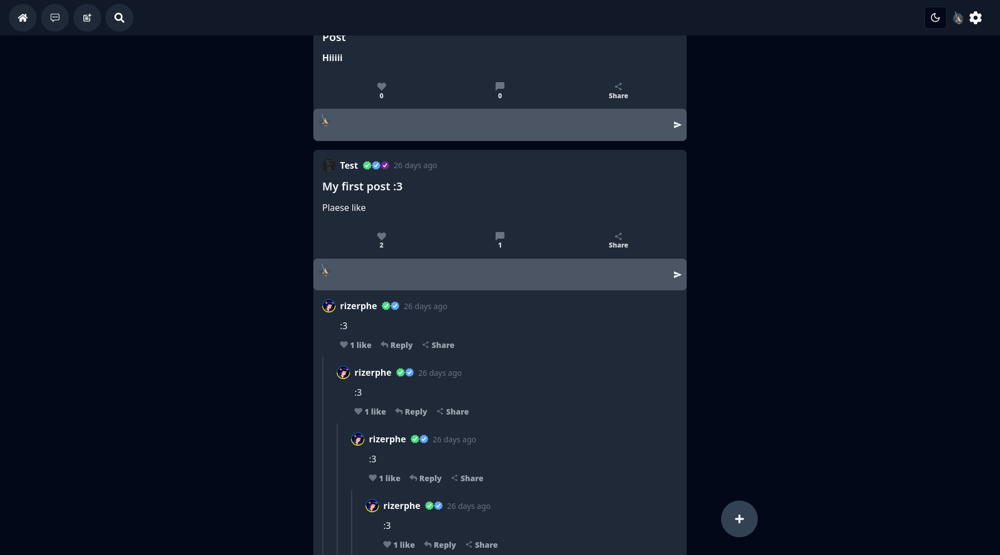
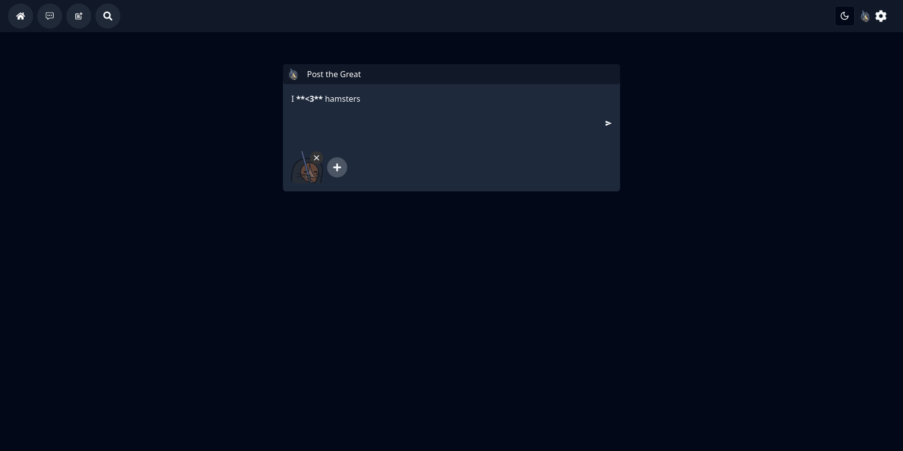
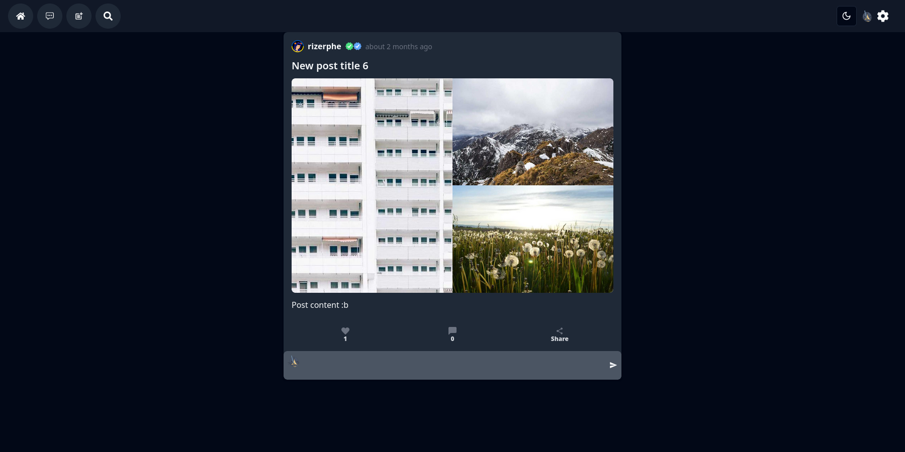
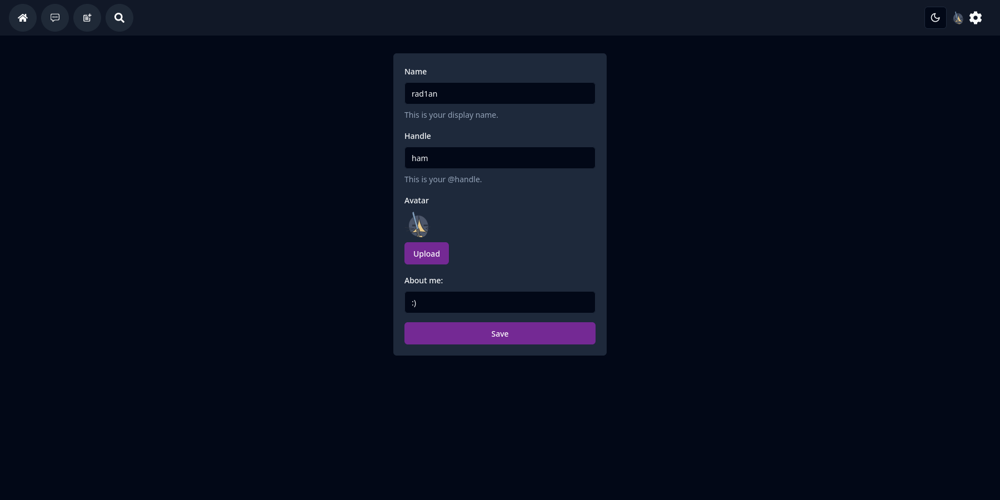
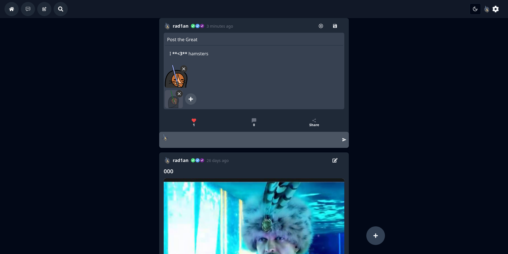
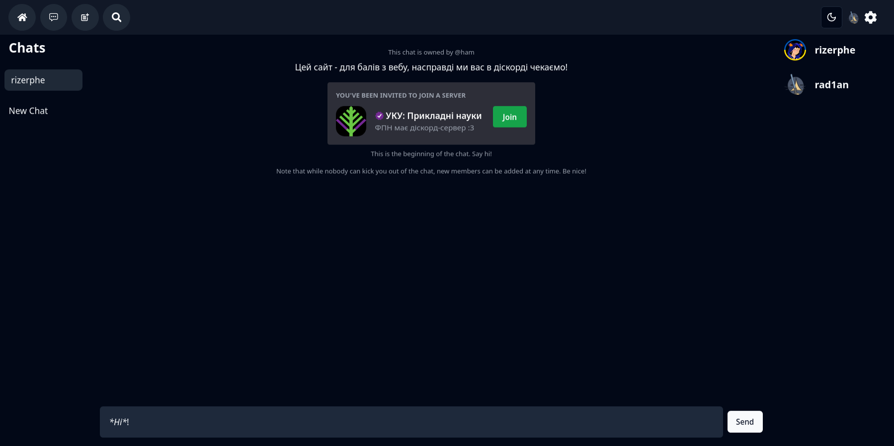

# A reddit-like social network

https://t.r1a.nl

As it is an educational project, the database is disabled, when not used for an extensive period of time. If you want to see the project in action, please contact the authors to enable it.

## Description

This is a reddit-like social network where users can create (with images attached), edit, comment and like posts.

## Showcase

